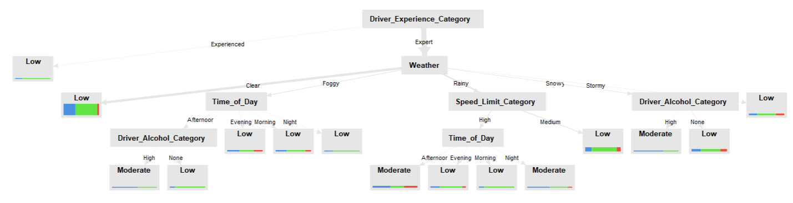
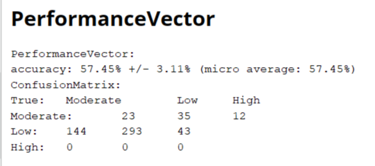

# Machine Learning with RapidMiner: Decision Trees & KNN

###  Author: Egor Vovk

This project applies **Decision Trees (DT)** and **K-Nearest Neighbors (KNN)** for accident classification using **RapidMiner**.
 The dataset contains accident-related features, and the goal is to predict accident severity and occurrence.

---

##  Project Structure
 RapidMiner-ML-traffic_accident:
 
	|- **`data/`** : Contains the original dataset (CSV file).
	|- **`processed_data/`** : Holds the final processed results or predictions.
	|- **`screenshots/`** : Contains screenshots of model performance and results.
	|- **`README.md`**: Overview of the project.

---

##  Project Overview

### 1️) **Data Preprocessing**
- **Original dataset size:** `840` instances
- **After filtering missing values:** `405` instances
- **Duplicates found & removed:** `12`
- **Missing values handled with:** `Filter Examples (no_missing_attributes)`

### 2️) **Decision Tree Model**
- **Evaluated different criteria:**  
  - Gain Ratio  
  - Information Gain  
- **Best-performing model:**  
  - **Max Depth:** `10`  
  - **Pruning:** `Enabled`  
  - **Confidence:** `0.1`  
- **Key Rules for predicting an accident (`True`):**
  - `Weather = Foggy` + `Time of the day = Morning` → `Accident = True`
  - `Weather = Clear` + `Accident Severity = Low` → `Accident = True`
  - `Weather = Rainy` + `Speed Limit = Low` → `Accident = True`

### 3️) **KNN Model**
- **Selected features:**  
  `Traffic Density, Speed Limit, Number of Vehicles, Driver Alcohol, Driver Age, Driver Experience, Weather, Road Type, Accident Severity`
- **Normalization used?**  Yes (KNN is distance-based)
- **Best K value:** `K=9` (highest accuracy)

---

## ️ Model Performance Screenshots
| Decision Tree Results | KNN Performance |
|----------------|----------------|
|  |  |
| ![MODEL screenshot] (screenshots/mode.png) | 

---

##  How to Use This Project
1. **Clone the repository**  
   ```bash
   git clone https://github.com/yourusername/RapidMiner-ML-traffic_accident.git